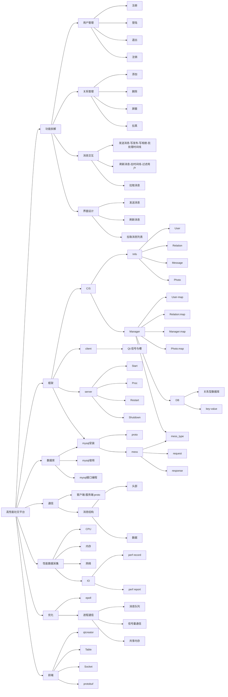

# SSP-update

名称: 高性能社交平台 

**项目简介**

服务器采用均衡模型，提高并发，分为用户管理、关系管理、消息交互和界面设计四个主要模块.在网络传输上和存储能力上，对客户端和服务器之间，服务器和数据库之间采用`protobuf`协议进行数据传输并在数据库中进行数据压缩；同时为了提升计算能力，各个模块独立地创建一个进程，采用共享内存`shared memory`(或环形消息队列)的方法，进行进程间的通信。在消息模块，批处理时间线，形成快照，减小了数据的传输压力。同时采用`epoll`多路复用基础上的主从反应堆模式，运用多线程`one thread one loop`模式，提高并发，并在计算能力、存储能力和网络传输能力上进行压力测试。前端使用`qtcreator`框架和`protobuf`框架进行收发包

**git**

```shell
git: https://github.com/ZiXuanLing/SSP-update.git
```

**博客**

```shell
https://blog.csdn.net/qq_48322523?spm=1011.2124.3001.5343
```

**性能采集**

计算能力：[statspack/cpu.png]
存储能力：[statspack/mem.png]
网络传输能力：[statstpack/net.png]

**后期构思**

- 完善前端应用
- 引入`libevent`第三方库，促进项目结构更加模块化
- 对共享内存划分更多的内存块，促进服务器交叉、平行的接收流量，提高并发
- 存储在内存中的数据使用`map`，同时数据存储考虑使用`key-value`数据库

新的一年，好好学习，好好休息。

**项目架构图**


